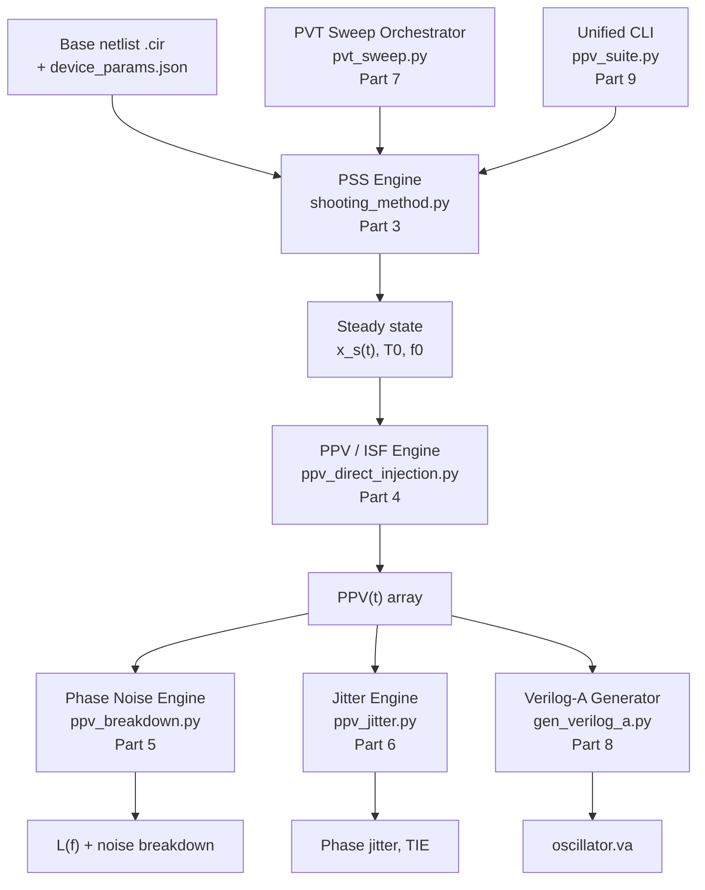

# The PPV Solver Suite, Explained From Zero
### A beginner's guide to phase-noise and jitter simulation for a custom-built oscillator analysis engine

*Part of the SiliconForge project*

---

**How this document came to be.** Three write-ups were produced while designing, defending, and stress-testing this suite — an architecture document, a design-review conversation, and an interview-style study guide. This file merges all three into one explanation, reorganized around *concepts* rather than around *which document said it first*.

**Who this is for.** A third-year ECE undergraduate — someone comfortable with basic circuit theory (KCL/KVL, capacitors, inductors), ordinary differential equations, and linear algebra (matrices, eigenvalues), but who has never opened a SPICE source file, never seen Verilog-A, and has no background in RF phase-noise theory or nonlinear numerical methods. Every one of those is built up from the ground floor below — nothing beyond the standard second/third-year toolkit is assumed.

**A calibration note.** This document explains the reasoning, math, and architecture behind the suite faithfully to the three source write-ups. A few narrative claims about specific run-time outcomes (exact numeric diagnostics, specific bug behaviors) are reported as the project's own account of what happened, since this explainer wasn't produced by re-running the actual codebase. Treat those as "here's what the design notes say happened," not as independently re-verified facts.

---

## Table of Contents

- [Part 0: The Big Picture](#part-0-the-big-picture)
- [Part 1: How a SPICE Simulator Computes Time](#part-1-how-a-spice-simulator-computes-time)
- [Part 2: The Xyce Verilog-A Singularity](#part-2-the-xyce-verilog-a-singularity)
- [Part 3: The PSS Engine](#part-3-the-pss-engine)
- [Part 4: The PPV and ISF Engine](#part-4-the-ppv-and-isf-engine)
- [Part 5: The Hajimiri Phase-Noise Engine](#part-5-the-hajimiri-phase-noise-engine)
- [Part 6: From Noise to Jitter](#part-6-from-noise-to-jitter)
- [Part 7: PVT Sweeps](#part-7-pvt-sweeps)
- [Part 8: The Verilog-A Generator](#part-8-the-verilog-a-generator)
- [Part 9: The Unified CLI](#part-9-the-unified-cli)
- [Part 10: Recap and Further Reading](#part-10-recap-and-further-reading)
- [Part 11: The V1 Varactor VCO — Seeing It Actually Run](#part-11-the-v1-varactor-vco-seeing-it-actually-run)
- [Appendix A: Formula Reference](#appendix-a-formula-reference)
- [Appendix B: Script Reference](#appendix-b-script-reference)

---

## Part 0: The Big Picture

### 0.1 What are we actually trying to measure?

An ideal oscillator is a perfect metronome: it ticks at exactly one frequency, forever, with zero variation. Plot its output voltage against time and you get a perfectly clean sine wave; plot its spectrum (voltage vs. frequency) and you get a single, infinitely thin spike at $f_0$.

Real oscillators don't do this. Thermal noise and flicker (1/f) noise inside the transistors constantly nudge the timing of every oscillation cycle, by a tiny random amount, in a tiny random direction. Zoom into the spectrum of a real oscillator and that "infinitely thin spike" is actually a small, blurry skirt of energy spreading out on either side of $f_0$. That blur is called **phase noise**, usually reported as $\mathcal{L}(f_m)$ in units of dBc/Hz — decibels relative to the carrier, per Hertz of measurement bandwidth, at some offset frequency $f_m$ away from $f_0$.

Why should you care about a blurry spectral line? Because that oscillator sits at the heart of nearly everything electronic that needs to keep time or hold a stable frequency:

- **PLLs (Phase-Locked Loops)** use a VCO (Voltage-Controlled Oscillator) as their tunable frequency source. Every wireless radio, every microprocessor clock tree, every high-speed serial link has one.
- **Radio receivers** mix an incoming signal down using a *local oscillator*; if that oscillator is noisy, a strong nearby interferer's own noise skirt can leak straight into your channel — a classic problem called *reciprocal mixing*.
- **ADCs (Analog-to-Digital Converters)** are only as precise as their sampling clock. A noisy clock edge means you don't actually know *when* you sampled, which directly degrades the converter's effective resolution.
- **Digital communication links** translate this same wobble into *jitter* — how many picoseconds early or late a clock edge arrives — which eats directly into the timing margin that keeps a receiver from misreading a bit.

So: this entire suite exists to answer one specific, important question about a custom oscillator design — *exactly how blurry is your spectral line, and exactly how many picoseconds of timing wobble does that translate into* — using nothing but open-source software.

### 0.2 Why not just use a commercial tool?

Cadence's SpectreRF already ships with exactly the analyses needed here: PSS (Periodic Steady State), PAC (Periodic AC), and PNoise (Periodic Noise). These are polished, validated, industry-standard tools — and they are also expensive, license-gated, and typically only available inside a university or company EDA lab.

Open-source SPICE-class simulators — ngspice, and Xyce (an open-source, parallel circuit simulator from Sandia National Laboratories) — are perfectly capable of running an ordinary transient simulation, but neither ships with a built-in shooting-method PSS engine or a PNoise-style cyclostationary noise analysis out of the box. They will happily produce voltage-vs-time data; they will not, by themselves, turn that into a phase-noise number.

That gap — a transient simulator with no path from "voltage waveform" to "phase-noise spectrum" — is exactly what this suite fills, by using Python to orchestrate a plain transient simulator the way a much more expensive tool would orchestrate itself internally.

### 0.3 The elevator pitch

Feed the suite a SPICE netlist of an oscillator. It automatically finds the oscillator's exact repeating steady-state waveform (Part 3), measures how sensitive that waveform's timing is to a tiny nudge at every point in its cycle (Part 4), converts that sensitivity profile into a phase-noise spectrum using device noise data (Part 5), integrates that spectrum into a single jitter number (Part 6), repeats the whole thing automatically across every manufacturing/voltage/temperature corner your chip might see in real life (Part 7), and — as a bonus — exports a fast behavioral model of the oscillator that a system-level PLL simulation can use without ever touching a transistor equation again (Part 8). One command-line tool (Part 9) drives the entire pipeline.

### 0.4 The map



Keep this picture in mind. Everything from here on is "what happens inside one of these boxes, and why it had to be built that particular way."

---

## Part 1: How a SPICE Simulator Computes Time

### 1.1 Circuits are continuous; computers are not

A capacitor's defining equation is continuous and exact:

$$I(t) = C \frac{dV(t)}{dt}$$

A computer cannot evaluate a continuous derivative — it can only evaluate things at a finite list of discrete time points $t_0, t_1, t_2, \dots$, separated by a step size $\Delta t$. So the first job of any SPICE-class simulator is to turn that clean differential equation into an algebraic one that only involves values *at those discrete points*. This is called **discretization**, and there are three classic ways to do it:

- **Forward Euler** (explicit): approximate the derivative using the *old* value, $\frac{dV}{dt} \approx \frac{V_n - V_{n-1}}{\Delta t}$. Cheap, but numerically fragile for anything fast-moving or stiff.
- **Backward Euler** (implicit): approximate the derivative using the *new* value instead, $\frac{dV}{dt} \approx \frac{V_{n+1} - V_n}{\Delta t}$, giving $I_{n+1} = C\frac{V_{n+1}-V_n}{\Delta t}$. This is implicit because $V_{n+1}$ appears on both sides of the overall circuit equations, but it buys much better numerical stability.
- **Trapezoidal rule**: average the forward and backward slopes. Second-order accurate (global error shrinks as $\mathcal{O}(\Delta t^2)$ rather than the Euler methods' $\mathcal{O}(\Delta t)$), and the default integration method in most SPICE variants.

Whichever rule you pick, the effect is the same: every capacitor and inductor gets replaced, at each timestep, by an equivalent resistor-plus-source "companion model" that only depends on **known** values from the previous step. That turns "solve a differential equation" into "solve a system of algebraic equations, once per timestep" — which a computer can actually do.

### 1.2 Nonlinear circuits need Newton-Raphson

If every device in your circuit were linear (plain resistors, capacitors, inductors, independent sources), step 1.1 alone would already leave you with a simple linear system to solve at each timestep — easy.

Transistors are not linear. Their current depends on their voltages in a curved, transcendental way. So at every single timestep, the simulator has to solve a system of *nonlinear* algebraic equations, $\mathbf{f}(\mathbf{x}) = \mathbf{0}$, where $\mathbf{x}$ is the vector of every node voltage and branch current in your circuit — the full description of the circuit's state at that instant. The standard tool for this is the **Newton-Raphson method**:

$$\mathbf{x}_{k+1} = \mathbf{x}_k - \mathbf{J}^{-1}(\mathbf{x}_k)\, \mathbf{f}(\mathbf{x}_k)$$

where $\mathbf{J}$ is the **Jacobian matrix** of partial derivatives, $J_{ij} = \frac{\partial f_i}{\partial x_j}$. Guess a solution, measure how wrong it is ($\mathbf{f}(\mathbf{x}_k)$), use the local slope ($\mathbf{J}$) to make a smarter guess, repeat until the error is negligible. This inner Newton-Raphson loop runs *at every single timestep* of a transient simulation — it's the actual engine turning over underneath every SPICE run you've ever done, whether you noticed it or not.

### 1.3 What breaks: the singular Jacobian

Newton-Raphson has exactly one catastrophic failure mode: if $\mathbf{J}$ becomes **singular** — its determinant hits zero, so it has no inverse — the update step $\mathbf{J}^{-1}\mathbf{f}(\mathbf{x}_k)$ is undefined, and in practice, as $\mathbf{J}$ gets *close* to singular, the computed step explodes toward infinity instead of converging. Geometrically, this happens when the local slope of your error function goes flat in some direction — the solver has no useful information about which way to move, so it lurches.

This is the exact failure this whole project starts with. Keep it in your back pocket; it reappears twice, in two different guises, in Parts 2 and 3.

### 1.4 Why foundry Verilog-A models make this worse

Foundries don't hand you a simple textbook transistor equation — they hand you a **Verilog-A** compact model: a program, often thousands of lines long, that reproduces a real silicon transistor's behavior with extreme physical accuracy across every bias condition, temperature, and geometry. PSP103 (used in this project) is one such industry-standard compact MOSFET model.

The price of that accuracy is *extremely* sharp, highly nonlinear internal derivatives during fast transitions — exactly the kind of thing that can push a Newton-Raphson Jacobian toward singular if the simulator's timestep is too coarse to track the transition closely. A simplified textbook model (a basic SPICE primitive) is smoother and far more forgiving; a full physical compact model is not. That trade-off — physical accuracy vs. numerical friendliness — is the entire reason Part 2 exists.

---

## Part 2: The Xyce Verilog-A Singularity

### 2.1 The setup

The oscillator under test is a classic **LC cross-coupled VCO**, targeting roughly 10 GHz, built in IHP's open-source SG13G2 process (a real, publicly available 130 nm SiGe BiCMOS PDK). It has three standard pieces:

- **An LC tank** — an inductor and capacitor in parallel, forming the frequency-determining resonator. Left alone, it would ring at $\omega_0 = 1/\sqrt{LC}$ and slowly decay, because real inductors and capacitors have loss.
- **A cross-coupled transistor pair** — two transistors wired so each one's gate is driven by the *other's* drain. This positive-feedback loop makes the pair behave like a **negative resistor**: it constantly pumps a little energy back into the tank, exactly canceling the tank's natural losses, so the oscillation sustains forever instead of dying out.
- **A tail current source** — sets the bias current (and therefore the amplitude) of the whole structure.

The transistors in that cross-coupled pair are modeled with the foundry's PSP103_VA Verilog-A model — not a simplified textbook approximation, the real thing.

### 2.2 What broke

Simulating this circuit above its actual operating frequency (10+ GHz) caused Xyce to throw `MSG_FATAL` errors. Per Part 1.3, this is exactly a Newton-Raphson Jacobian blowing up: during the cross-coupled pair's rapid switching transitions, the PSP103_VA model's internal derivatives became so sharp that Xyce's default adaptive-step algorithm — which tries to take the *biggest* timestep it can get away with, for speed — occasionally stepped straight over the transition and landed somewhere the Jacobian was effectively singular.

### 2.3 Engineering move #1: build a control variable

Before spending days fighting the Xyce/Verilog-A interaction directly, the project built a **proxy model** (`tune_10ghz_proxy.cir`): a circuit with the *exact same topology* (same cross-coupled pair, same LC tank, same tail source) but with the heavy PSP103_VA models swapped out for plain, well-behaved SPICE primitives, carefully tuned so the tank resonance and negative transconductance matched the real design.

This is good experimental method, not a shortcut. It isolates one variable at a time: *is my Python PSS/PPV/PNoise math correct*, independent of *is Xyce's Verilog-A interpreter behaving*? The proxy model let the entire rest of the suite (Parts 3 through 9) be built and validated on a circuit that never crashed, before ever touching the harder problem of the real foundry model.

### 2.4 Engineering move #2: clamp the step size

The actual fix for the real PSP103_VA model, once found, was simple to state and directly explained by Part 1.1–1.3: force every single Newton-Raphson-per-timestep evaluation to happen close enough together in time that the solver never has to extrapolate across the sharpest part of the transistor's switching nonlinearity.

Concretely, two netlist-level options:

```spice
.OPTIONS NONLIN MAXSTEP=100
.TRAN 1p 20n 0 0.1p UIC
```

The `.TRAN` card's syntax is `.TRAN <print-step> <stop-time> <start-time> <max-internal-step> [UIC]`. Setting the maximum *internal* timestep to `0.1p` (0.1 picoseconds) forces Xyce to never let its adaptive algorithm wander further than 0.1 ps between Jacobian evaluations, no matter how confident it feels — which keeps every Newton guess close enough to the true next state that the sharp Verilog-A derivative never gets extrapolated across. `NONLIN MAXSTEP=100` raises the ceiling on how many Newton-Raphson iterations Xyce is allowed per timestep before giving up, giving the now much better-conditioned solve extra room to converge.

**Let's check the arithmetic**, because it matters for what comes next: a 10 GHz oscillation has a period of $T_0 = 1/10\text{GHz} = 100\text{ ps}$. Sampling every $0.1$ ps gives $1000$ samples per cycle — genuinely fine resolution. Over a $20\text{ ns}$ run, that's $20{,}000\text{ ps} / 0.1\text{ ps} = 200{,}000$ total samples per node. That number is going to matter again in Part 7.3.

### 2.5 Check your understanding

> **🎙️ Say it out loud — "Why did forcing a 0.1 ps step fix the Xyce crash?"**
>
> Because the sharp, highly nonlinear derivatives inside the Verilog-A model only appear during the transistor pair's fast switching transitions. Xyce's default adaptive-step algorithm was allowed to guess too far ahead into those transitions, landing on a state where the Jacobian was effectively singular. Clamping every step to 0.1 ps keeps every Newton-Raphson guess close enough to the true next state that the solver never has to extrapolate across that sharp nonlinearity — the singularity was never really "fixed," it was simply never allowed to be approached.

---

## Part 3: The PSS Engine

### 3.1 What "steady state" means for something that never stops moving

For a normal (non-oscillating) circuit, "steady state" usually means "everything has settled to a constant DC value." An oscillator, by definition, never settles to a constant value — it keeps moving forever. So **Periodic Steady State (PSS)** means something different here: find the state vector $\mathbf{x}_s(t)$ and the exact period $T_0$ such that

$$\mathbf{x}_s(t + T_0) = \mathbf{x}_s(t) \quad \text{for all } t$$

Geometrically, if you plot the oscillator's state (say, tank voltage vs. inductor current) as a trajectory in state space, a healthy oscillator's trajectory doesn't wander off or spiral into a point — it converges onto and then travels around one fixed closed loop, forever. That closed loop is called a **limit cycle**. PSS analysis is the search for that loop.

### 3.2 Why not just run a long transient and wait?

You *could* just run an ordinary transient simulation for long enough that any initial startup transient dies out, and read off the last cycle as your steady state. It works, but it's slow (you're paying for all the "settling" time you don't actually care about) and it doesn't scale: Part 7 needs this exact search repeated across dozens of different process/voltage/temperature corners. Waiting out a full settling transient every single time is exactly the kind of computational cost this whole project exists to avoid. What's needed is a way to jump *directly* to the limit cycle, without simulating the boring transient run-up to get there.

### 3.3 Attempt 1: standard shooting Newton-Raphson

The classic tool for this is the **shooting method**: guess an initial state $\mathbf{x}_0$ and a period $T$, integrate the circuit forward for time $T$, and check whether you land back where you started:

$$\mathbf{x}(T) - \mathbf{x}_0 = \mathbf{0}$$

If not, use Newton-Raphson (yes, again — this is a second, *outer* layer of Newton-Raphson, wrapped around the *inner* per-timestep Newton-Raphson from Part 1.2) to correct the guess, using the **state transition matrix** $\mathbf{\Phi} = \frac{\partial \mathbf{x}(T)}{\partial \mathbf{x}_0}$ as the Jacobian of this outer problem.

The first implementation tried to solve for *both* $\mathbf{x}_0$ **and** $T$ simultaneously in that same Newton-Raphson update. It diverged badly: across iterations, the estimated period ballooned from a sane $100\text{ ps}$ guess all the way out to $7700\text{ ps}$ — 77 times too long — before the Jacobian went singular and the whole thing collapsed.

*Why?* An autonomous (free-running) oscillator has a structural quirk: its limit cycle is **translation-invariant in time**. If $\mathbf{x}_s(t)$ is a valid steady-state solution, so is $\mathbf{x}_s(t + \tau)$ for literally any shift $\tau$ — there is no "correct" starting phase, only a correct *shape*. That means the state's sensitivity to a shift in time collapses toward zero in some direction (a flat spot in the error landscape) — precisely the Part 1.3 failure mode, a near-zero derivative sending the Newton correction wild. Imagine hiking blindfolded and using the local slope under your feet to decide how big a step to take: on a steep hillside, small steps are fine; on a spot that's nearly flat, that same rule tells you to take an enormous step, because dividing by a slope near zero always produces something huge. That is exactly what happened to $T$.

### 3.4 Attempt 2: damped Newton-Raphson

The next fix was a standard numerical-methods trick: **damping**, i.e., simply refusing to let any single update step get too large. The voltage-update vector was capped at $0.1\text{ V}$ per iteration; the period-update was capped at $5\%$ of the current $T_0$ estimate.

This worked — partially. $T_0$ no longer ran away to absurd values; it settled into a believable range, wobbling between about $109\text{ ps}$ and $115\text{ ps}$ (recall the true target is $100\text{ ps}$ for 10 GHz, so this is now in the right neighborhood). But the underlying Jacobian *still* eventually went singular, because the root cause wasn't just "the step size is too aggressive" — it was a genuine **structural** zero-gradient, baked into the perfect symmetry of the cross-coupled pair, that damping alone can only slow down, not remove. Capping the step size is a seatbelt; it doesn't fix the fact that the road itself has a hole in it.

### 3.5 Attempt 3: the Poincaré map

The real fix required changing the *mathematical formulation* of the problem, not just tuning the numerics around it. The insight: **stop trying to solve for $T$ as an unknown in the Newton-Raphson update at all.**

Instead, define a physical trigger condition — a **Poincaré section** — somewhere on the trajectory: for example, "the moment $V(\text{out\_p})$ crosses $1.2\text{ V}$ while rising." Run the simulation slightly past a rough period guess (say $1.2 \times T_{\text{guess}}$), and find the *exact* time $T_{\text{cross}}$ at which that specific physical condition is met. That measured time — not a guessed number fed into a derivative matrix — **is** your period for this iteration. Newton-Raphson is then only ever asked to do one job: adjust the initial voltage vector $\mathbf{x}_0$ so that the state measured at $T_{\text{cross}}$ matches $\mathbf{x}_0$ again.

Here's the intuition for *why* this removes the ambiguity from Attempt 1: instead of asking "where is the trajectory after exactly 100 picoseconds" (a question with no unique answer for a time-translation-invariant limit cycle — 100 ps *from when*?), you ask "where is the trajectory the next time it crosses this one specific gate" — which is a single, unambiguous point on the loop, every time. You've traded an arbitrary clock reading for a physical mile-marker on the racetrack. This is, in fact, exactly how commercial tools like Cadence SpectreRF's own PSS engine handles autonomous oscillators internally.

With $T$ removed from the unknowns, the remaining Newton-Raphson problem (solve only for $\mathbf{x}_0$) is well-posed, and it converges reliably. If you can sketch the limit cycle as a closed loop in a simple voltage-vs-current plot and mark the exact line where this trigger condition slices through it, you've essentially explained the entire idea — that sketch *is* the Poincaré section.

### 3.6 A bonus payoff: the monodromy matrix and Floquet multipliers

Here's a nice piece of "you already paid for this, so use it": during the *final* Newton-Raphson iteration of the Poincaré-map shooting method, the solver has *already computed* the state transition matrix over exactly one period, $\mathbf{\Phi}(T,0)$ — this is called the **monodromy matrix**. You don't need to run anything extra to get it; it falls out of the last iteration for free.

Its eigenvalues are called **Floquet multipliers**, and — this is the exact same idea you already know from linear algebra, where a matrix's eigenvalues describe how it stretches or shrinks different directions — they tell you about the *stability* of the limit cycle:

- **Exactly one** multiplier must equal $1$ (to within numerical precision). This is the time-translation direction from Part 3.3: nudging the state along the trajectory doesn't grow or shrink anything, it just relabels which point on the same loop you call "$t=0$."
- **Every other** multiplier must have magnitude strictly **less than 1**. These correspond to amplitude/shape perturbations — if you bump the oscillator off its limit cycle in these directions, the oscillator relaxes back *toward* the loop rather than spiraling away from it.

If the largest non-unity multiplier creeps close to $1$, that's a real, actionable warning sign: the oscillator has weak amplitude stability, and small disturbances will take a long time to die out (or might not, in the worst case). This diagnostic is essentially a free byproduct of the PSS solver you already built. (Part 11 shows this exact eigenvalue technique running for real, printed straight out of a live solver.)

---

## Part 4: The PPV and ISF Engine

### 4.1 What does "phase sensitivity" even mean?

Here's a physical way to build intuition before any math: think of a **pendulum**, not an LC tank (they are mathematically the same kind of oscillator, so the intuition transfers directly). Give the pendulum a very light, very quick tap.

- Tap it right at the **bottom** of its swing, where it's moving fastest (all kinetic energy, no potential energy): you shift its timing by a lot. The tap either helped or hurt its swing speed right when speed mattered most.
- Tap it right at the **top** of its swing, where it's momentarily motionless (all potential energy, no kinetic energy): the tap barely changes its timing at all. There's no "velocity" for the tap to meaningfully add to or subtract from at that instant.

The **Impulse Sensitivity Function (ISF)** — also called the **Perturbation Projection Vector (PPV)**, written $\Gamma(t)$ or $\mathbf{v}_1(t)$ depending on the convention — is exactly this idea, made precise and periodic: a dimensionless function describing *how much permanent phase shift results from injecting one unit of charge at time $t$ within the cycle.* It's large where the oscillator is "moving fast" through its cycle (an LC tank's zero-crossings — maximum $dV/dt$, maximum inductor current) and small where it's "momentarily still" (an LC tank's voltage peaks — zero $dV/dt$, all energy sitting in the capacitor).

*(A quick terminology note, since the literature isn't consistent: this exact same object gets called the **PPV**, the **ISF**, $\Gamma(t)$, or $\mathbf{v}_1(t)$ depending on the source. PPV/ISF/$\Gamma(t)$ usually signal "here's the simple scalar recipe" below; $\mathbf{v}_1(t)$ usually signals "here's the full vector state-space theory" in 4.6. They're the same thing, seen from two angles.)*

### 4.2 The Direct Injection Method: actually measuring it

1. **Baseline:** run one very clean, unperturbed transient simulation to get the exact period $T_0$ and frequency $f_0$.
2. **Phase sweep:** divide $T_0$ into $N$ equally spaced phase bins (the source project uses, for example, $N=33$ — an illustrative choice, not a magic number; more bins buys resolution at the cost of more simulation runs).
3. **Netlist mutation:** for each phase bin, generate a new `.cir` file with a tiny SPICE `PULSE` current source injected at that specific time offset, into a node of interest (`out_p`, `out_n`, `tail`, etc.), carrying a small, fixed charge $\Delta q$.
4. **Measure the shift:** let the perturbed waveform run and settle, then measure the resulting time shift $\Delta T$ of its zero-crossings *relative to the unperturbed baseline*.
5. **Convert to phase, then to sensitivity:**

$$\Delta\phi = 2\pi\,\frac{\Delta T}{T_0} \qquad\qquad \text{PPV}(t) = \frac{\Delta\phi(t)}{\Delta q}$$

Repeat across all $N$ bins and you have the complete $\text{PPV}(t)$ curve over one period.

One practical refinement worth knowing about: running a full transient simulation for every single phase bin gets expensive fast — especially once Part 7's PVT sweep starts repeating this process dozens of times over. Because the PPV is known to change most sharply right around the zero-crossings (see 4.5) and stays nearly flat near the voltage peaks, an **adaptive sampling grid** — many bins packed densely around the zero-crossings, only a few sparse ones near the peaks — captures the same curve shape using far fewer total simulation runs than a uniform grid, without losing accuracy where it actually matters. (You'll see this exact technique confirmed in a real run in Part 11 — it turns out to cut a 33-point grid down to just 8 points.)

A subtlety worth sitting with: why does measuring $\Delta T$ at all, *long after* the injection, actually isolate the *phase* effect specifically? Because (per Part 3.6) any perturbation purely in an *amplitude* direction decays back toward the limit cycle — it can't leave a permanent trace. A perturbation along the *phase* direction is different: since the limit cycle is time-translation-invariant, a phase nudge is a completely valid new starting point on the exact same loop, so it never decays away. Measuring a $\Delta T$ that persists indefinitely after the transient settles is, by construction, measuring pure phase shift.

### 4.3 Getting femtosecond precision out of picosecond samples

Data only exists at discrete $0.1\text{ ps}$ sample points (Part 2.4), but the true zero-crossing of a $10\text{ GHz}$ signal almost never lands exactly on one of them. The fix is **interpolation**: given the two sample points that straddle the crossing, estimate where in between it actually happened.

The straightforward version is **linear interpolation** — draw a straight line between the two bracketing points and solve for where it crosses zero. It's simple and it works, but it implicitly assumes the waveform has a constant slope between those two points, which real waveforms don't (they curve). A more refined version — a natural next upgrade — is to fit a small **cubic spline** through, say, four points on either side of the crossing (`scipy.interpolate.CubicSpline` on a local window) and find *that* curve's root. A cubic captures the waveform's curvature (its second derivative) that a straight line simply throws away, buying meaningfully better precision on $T_0$ and, downstream, on $\Delta T$ and the whole PPV curve — at almost no extra computational cost, since it's a tiny local fit, not a global one.

### 4.4 Case study: the −9.7 × 10¹⁵ bug

Before the 0.1 ps step clamp existed, and with a looser timestep (e.g., $1\text{ ps}$), the PPV extraction occasionally reported an absurd value — on the order of $-9.7 \times 10^{15}$ — for what should have been a small, physically bounded sensitivity number.

The diagnosis: at the loose $1\text{ ps}$ resolution, the zero-crossing detector sometimes failed to find a valid crossing inside its expected search window, and silently fell back to a default value of $T=0$. Subtracting that fake $T=0$ from the true crossing time produced a gigantic, physically meaningless $\Delta T$, which the PPV formula then happily divided by $\Delta q$ and reported as fact.

This is a genuinely useful lesson in defensive numerical coding, independent of RF theory: **a fallback value that is only supposed to trigger in an edge case is invisible right up until that edge case actually happens — at which point it becomes a silent, catastrophic bug rather than a loud, obvious crash.** A function that returns "0" as a safe-looking default is far more dangerous than one that raises an explicit error, because "0" looks like real data. The permanent fix was the same one from Part 2.4 — tightening to a $0.1\text{ ps}$ step meant the search window reliably bracketed a genuine crossing every single time, so the fallback path was never exercised again. One fix, two unrelated-looking bugs solved.

### 4.5 Check your understanding

> **🎙️ Say it out loud — "If I inject a current pulse into the LC tank exactly when the voltage is at its absolute maximum, what happens to the phase?"**
>
> Nothing, to first order — the ISF is essentially zero there. At the voltage peak, all of the tank's energy is stored in the capacitor and the inductor current (and therefore $dV/dt$) is momentarily zero. A small charge injection at that instant mostly just nudges the *amplitude* slightly, which — per Part 3.6 — decays back into the limit cycle rather than leaving a lasting phase trace. Maximum phase sensitivity instead occurs at the zero-crossings, exactly where energy is actively transferring between the inductor and capacitor and the state is moving fastest — precisely the pendulum-at-the-bottom-of-its-swing intuition from 4.1.

### 4.6 The actual theory underneath (for when the recipe isn't enough)

Everything in 4.1–4.5 is an *operational recipe* — inject a pulse, measure a shift, divide. It works, and it's how the suite actually computes numbers. But there's a deeper, more rigorous mathematical structure underneath it worth knowing, because it's also what tells you *how to check that your answer is actually right* (Part 4.7).

Linearize the circuit's behavior around the steady-state trajectory $\mathbf{x}_s(t)$ from Part 3. A small perturbation $\Delta\mathbf{x}(t)$ evolves according to

$$\frac{d\,\Delta\mathbf{x}(t)}{dt} = \mathbf{J}(t)\,\Delta\mathbf{x}(t)$$

where $\mathbf{J}(t)$ is the same Jacobian from Part 1.2, but now evaluated *along the moving steady-state trajectory* rather than at one fixed operating point — so it's periodic in time, $\mathbf{J}(t+T_0)=\mathbf{J}(t)$. A system like this — linear, but with time-varying coefficients — is called a **Linear Time-Varying (LTV)** system (as opposed to the more familiar LTI systems from a first signals-and-systems course, where the coefficients don't change over time).

The trajectory's own velocity, $\dot{\mathbf{x}}_s(t)$, turns out to *already be* one valid periodic solution of this LTV system, corresponding to exactly the Floquet multiplier of $1$ from Part 3.6 — makes sense, since nudging along the direction the trajectory is already moving is precisely a time-shift.

The PPV, $\mathbf{v}_1(t)$, is defined as the periodic solution of the **adjoint** system:

$$\frac{d\mathbf{v}_1(t)}{dt} = -\mathbf{J}^T(t)\,\mathbf{v}_1(t)$$

— the same equation, transposed and sign-flipped — again tied to the Floquet multiplier of $1$, but normalized by a special partnership with $\dot{\mathbf{x}}_s(t)$ called **biorthogonality**:

$$\mathbf{v}_1^T(t) \cdot \dot{\mathbf{x}}_s(t) = 1 \quad \text{for every } t$$

Why does this particular normalization matter? Because it's exactly what makes $\mathbf{v}_1(t)$ behave as a pure **phase-only detector**: project any perturbation purely along the trajectory's own direction ($\propto \dot{\mathbf{x}}_s(t)$) onto $\mathbf{v}_1(t)$ and, by construction, you get back exactly the size of that phase shift — while a perturbation purely in an amplitude direction projects to *zero*. That's the whole reason the direct-injection recipe in 4.2 is allowed to attribute the *entire* measured $\Delta T$ to phase and nothing else.

### 4.7 How do you know your PPV solver is actually correct?

Treat these six checks the way you'd treat unit tests for any other piece of software — each one is specifically designed to catch a different class of bug.

| # | Test | What it checks | What a failure means |
|---|------|-----------------|------------------------|
| 1 | **Biorthogonality** | Is $\mathbf{v}_1^T(t)\cdot\dot{\mathbf{x}}_s(t) = 1$ at *every* time point, not just on average? | A drift or oscillation here points to a bad Jacobian evaluation or a flawed Floquet-eigenvector extraction. |
| 2 | **Strict periodicity** | Does $\mathbf{v}_1(0) = \mathbf{v}_1(T)$ to within machine precision? | A discontinuity or spike at the boundary means your integrator is accumulating numerical dissipation, or there's an off-by-one error in how the periodic boundary-value problem was set up. |
| 3 | **Ideal LC tank benchmark** | For a lossless tank with $V(t)=A\cos(\omega_0 t)$, is the PPV a perfect $\sin(\omega_0 t)$ — exactly $90^\circ$ phase-shifted from the voltage — scaling exactly as $1/C$ and $1/A$? | Since the true analytical answer is known exactly here, *any* deviation is an unambiguous bug — usually a Jacobian formulation injecting phantom nonlinearity where none exists. |
| 4 | **Stiff ring-oscillator benchmark** | On a simple 3-stage CMOS ring oscillator, does the PPV show sharp, isolated peaks right at each inverter's threshold crossing, and near-zero everywhere the inverters sit saturated at the rails? | Visible "ringing" (Gibbs-phenomenon-like oscillation) around the sharp transitions means the integrator lacks the numerical damping needed for stiff problems — swap Trapezoidal for an implicit **Backward Differentiation Formula (BDF / Gear's method)**, which handles sharp transitions far more gracefully. |
| 5 | **Orthogonality to amplitude perturbations** | Does a perturbation that is deliberately built to push the trajectory off the limit cycle in an amplitude-only direction — $\Delta\mathbf{x}_{\text{amp}}$ — project to $\mathbf{v}_1^T(t)\cdot\Delta\mathbf{x}_{\text{amp}} = 0$? | This is the direct test of the "phase-only detector" property from 4.6. Failure means your solver is conflating amplitude and phase sensitivity. |
| 6 | **Grid-independence** | Extract the PPV using $N=100$, $N=1000$, and $N=10{,}000$ points per period. Does the L2-norm error between them shrink at the rate expected for your integrator's order (e.g., $\mathcal{O}(\Delta t^2)$ for a second-order method)? | If the error doesn't shrink predictably, the solver isn't actually converging as the grid refines — it might look right at one particular resolution purely by coincidence. |

Practically, this suggests a three-tier build order rather than jumping straight to the hard problem:

1. **Linear oscillator** (ideal LC tank, time-*invariant* Jacobian): confirm you recover an undistorted cosine/sine pair.
2. **Van der Pol oscillator** (a classic textbook nonlinear limit cycle, with amplitude-limiting nonlinear damping): confirm the PPV correctly separates from amplitude variations.
3. **Full biorthogonality audit**: confirm test #1 holds to within roughly $10^{-5}$ at every single grid point, across the whole period.

Two more implementation notes worth carrying forward from here: computing $\mathbf{J}(t)$ via plain finite differences (perturb each state, re-measure, divide) works, but it injects numerical noise into a quantity you're about to differentiate and normalize repeatedly — using exact, analytical derivatives (whether hand-derived or via automatic differentiation) avoids that whole problem. And because the adjoint equation in 4.6 is most naturally solved backward in time (or as a periodic boundary-value system), the same integrator guidance from test #4 applies here too: an implicit method (BDF, or implicit Trapezoidal) is the safer default over a plain explicit scheme. Part 11 shows a real implementation of exactly this test suite, running automatically and printing a pass/fail for each check.

---

## Part 5: The Hajimiri Phase-Noise Engine

### 5.1 What phase noise actually is, intuitively

Picture the oscillator as a clock hand sweeping around a dial at a perfectly constant angular rate — that's the ideal case from Part 0.1. Now let every tiny random nudge from Part 4 (each one caused by real thermal or flicker noise inside the transistors, landing at a random point in the cycle) accumulate. The hand doesn't sweep at a perfectly constant rate anymore; it wobbles, a hair fast here, a hair slow there. **Phase noise**, $\mathcal{L}(f_m)$, quantifies exactly how much spectral energy that wobble smears out on either side of the clean carrier tone, at a given offset frequency $f_m$.

### 5.2 The Hajimiri integral, term by term

The **Hajimiri-Lee phase noise integral** turns the PPV curve from Part 4 directly into that spectrum:

$$\mathcal{L}(f_m) = 10\log_{10}\left(\frac{\Gamma_{\text{rms}}^2 \cdot S_{\text{thermal}} \;+\; \Gamma_{\text{dc}}^2\cdot S_{\text{flicker}}(f_m)}{2\,q_{\text{max}}^2\,(2\pi f_m)^2}\right)$$

Reading it piece by piece:

- $\Gamma_{\text{rms}}$ — the RMS value of the whole PPV/ISF curve over one period (a single dimensionless number summarizing "how sensitive is this oscillator to noise, overall").
- $\Gamma_{\text{dc}}$ — the DC (average) value of the same curve.
- $S_{\text{thermal}}$, $S_{\text{flicker}}(f_m)$ — the device's own current-noise power spectral density (units A²/Hz): thermal noise is flat with frequency, flicker noise rises as $1/f$ at low offsets.
- $q_{\text{max}}$ — the maximum charge swing across the tank's capacitance, which puts the dimensionless $\Gamma$ back into real physical (charge-domain) units.
- $f_m$ — the offset frequency from the carrier at which you want to know the noise level.

Notice that $f_m$ only appears squared in the denominator (aside from $S_{\text{flicker}}(f_m)$'s own $1/f_m$ dependence). That $1/f_m^2$ dependence is exactly why phase noise close to the carrier characteristically rolls off at $-20\text{ dB}$ per decade — the same slope Part 6 leans on directly.

### 5.3 Two separate noise stories: thermal vs. flicker

The formula splits cleanly into two physically distinct contributions:

- The $\Gamma_{\text{rms}}^2$ term captures how the transistors' **white (thermal) noise** — present at all frequencies, at a roughly constant level — gets folded by the oscillator's own time-varying sensitivity into the classic $1/f_m^2$ phase-noise skirt around the carrier.
- The $\Gamma_{\text{dc}}^2$ term captures how the transistors' **flicker ($1/f$) noise** — much larger at low frequencies, from slow trapping/detrapping effects in the transistor channel — gets *upconverted* into a much steeper $1/f_m^3$ region very close to the carrier.

Why the split? Thermal noise is "AC-like" (it's there throughout the whole cycle at roughly the same level), so it couples through the *entire swing* of the ISF, i.e., its RMS value. Flicker noise behaves more like a slow, near-DC drift, so it only couples through the ISF's *own average*, $\Gamma_{\text{dc}}$ — if the ISF's DC component happens to be exactly zero, flicker noise upconversion (theoretically) vanishes entirely, no matter how large the device's raw $1/f$ noise is.

### 5.4 Getting noise sources out of a black box: behavioral noise mapping

Here's a real practical wrinkle: Xyce treats PSP103_VA as an opaque black box. You get terminal voltages and currents out; you cannot ask it "what is your internal $g_m(t)$ or $I_d(t)$ doing right now, mid-cycle?" — which is exactly what you'd want to plug into the noise formulas above.

The workaround is **behavioral noise mapping**. A `device_params.json` file supplies the transistor's physical dimensions ($W$, $L$) and foundry noise constants (the flicker coefficient $K_F$, oxide capacitance $C_{ox}$, excess noise factor $\gamma$). From those, the engine computes *one* representative, stationary transconductance $g_m$ and drain current $I_d$ (essentially: "what's this transistor's noise behavior at its typical/average bias point"), then plugs them into the two standard textbook noise-source formulas:

$$S_{\text{thermal}} = 4kT\gamma g_m \qquad\qquad S_{\text{flicker}}(f_m) = \frac{K_F\, I_d}{C_{ox}\,W\,L\,f_m}$$

and multiplies each against the matching $\Gamma_{\text{rms}}^2$ / $\Gamma_{\text{dc}}^2$ term. The engine then emits a JSON breakdown and a pie chart, so a designer can immediately see which physical node — the tail current source, or the cross-coupled pair itself — dominates the total phase noise.

This "one representative number" approach is a genuine, first-order approximation — good enough to be immediately useful, and (per the project's own account) good enough that it correctly flagged the corrupted $-9.7\times10^{15}$ PPV outlier from Part 4.4 as an obviously anomalous, flicker/DC-dominated result before the root cause was even found — but it's not the full physical picture, which brings us to the next refinement.

### 5.5 The honest refinement: noise isn't actually stationary

Physically, $g_m(t)$ is *not* a constant number across the cycle. In a cross-coupled pair, each transistor is fully switched **on** for part of the cycle and essentially **cut off** ($g_m \approx 0$) for the rest, tracking the oscillation itself — this is called **cyclostationary** noise (its statistics repeat periodically, in sync with the circuit, rather than staying constant).

Because the steady-state solution from Part 3 already gives you the full, time-resolved $V_{gs}(t)$ and $V_{ds}(t)$ waveforms for every transistor, you don't actually need Xyce to hand you its internal states at all — you can evaluate a simple physical model (a basic Level-1 or EKV-style $g_m(V_{gs}, V_{ds})$ formula) directly against those known voltage arrays, producing a genuine time-varying $g_m(t)$. Multiply that *pointwise* against $\text{PPV}(t)^2$ before integrating (instead of collapsing everything to one averaged $\Gamma_{\text{rms}}^2$ number), and you correctly capture that noise injected while a transistor is switched off contributes essentially nothing — much closer to physical reality than the stationary approximation in 5.4, without needing anything from Xyce that it can't already provide.

### 5.6 The 1/f³ audit

Since $\Gamma_{\text{dc}}$ alone controls flicker upconversion (5.3), it's cheap and worthwhile to explicitly compute it, $\Gamma_{\text{dc}} = \frac{1}{T_0}\int_0^{T_0}\Gamma(t)\,dt$, after every PPV extraction and flag it if it's large. A large $\Gamma_{\text{dc}}$ is a genuine, actionable design warning — it usually points to asymmetric rise/fall times in the waveform, or a tail current source that's letting common-mode noise leak into the differential tank. The fix is a symmetry argument: a waveform with well-matched rise and fall times tends to drive $\Gamma_{\text{dc}}$ toward zero, which is exactly why "minimize 1/f³ noise" so often comes down, in practice, to "fix your layout symmetry and your tail current source." (Part 11 shows a real $\Gamma_{\text{dc}}/\Gamma_{\text{rms}}$ audit output from an actual oscillator — and it lines up with this exactly.)

> **🎙️ Say it out loud — "How do you minimize 1/f³ phase noise in an LC VCO?"**
>
> Flicker-noise upconversion is governed almost entirely by the DC component of the ISF, $\Gamma_{\text{dc}}$. Minimizing it comes down to symmetry: matching the rising and falling edges of the waveform, and designing the tail current source so it doesn't let common-mode noise leak into the differential tank. Push $\Gamma_{\text{dc}}$ close enough to zero, and the 1/f³ corner theoretically collapses back toward the carrier.

---

## Part 6: From Noise to Jitter

### 6.1 The same phenomenon, two different units

Phase noise, $\mathcal{L}(f)$, is a *frequency-domain* description — how much energy leaks into nearby frequencies. **Jitter** is the same underlying wobble described in the *time domain* instead — literally, how many picoseconds early or late a given clock edge actually arrives, compared to where a perfect clock's edge would be. RF engineers tend to think in phase noise (it directly predicts things like reciprocal-mixing and adjacent-channel interference); digital and communications engineers tend to think in jitter (it directly eats into a receiver's timing margin). The suite needs to hand back both, from the same underlying computation.

### 6.2 Turning a spectrum into one number, by calculus instead of simulation

In general, the RMS phase jitter over some measurement bandwidth is the integral of the phase-noise spectrum across that band:

$$\Delta\phi_{\text{rms}}^2 = 2\int_{f_{\text{min}}}^{f_{\text{max}}} 10^{\mathcal{L}(f)/10}\, df$$

Simulating this directly — running a long noisy transient and eyeballing an eye diagram until it converges statistically — is expensive. But because Part 5.2 already tells us $\mathcal{L}(f)$ falls at a known $-20\text{ dB}$/decade slope (i.e., $\mathcal{L}(f) \propto 1/f^2$) in the thermal-noise-dominated region, this integral has a genuinely elegant closed form once you anchor it at one known measured point $\mathcal{L}(f_m)$ at reference offset $f_m$. In that region, $\mathcal{L}(f) = \mathcal{L}(f_m)\cdot(f_m/f)^2$, so:

$$\int_{f_{\text{min}}}^{f_{\text{max}}} 10^{\mathcal{L}(f_m)/10}\left(\frac{f_m}{f}\right)^2 df = 10^{\mathcal{L}(f_m)/10}\,f_m^2\int_{f_{\text{min}}}^{f_{\text{max}}} \frac{df}{f^2} = 10^{\mathcal{L}(f_m)/10}\,f_m^2\left(\frac{1}{f_{\text{min}}}-\frac{1}{f_{\text{max}}}\right)$$

using $\int f^{-2}\,df = -1/f$. Putting the factor of 2 back:

$$\boxed{\Delta\phi_{\text{rms}}^2 = 2\cdot 10^{\mathcal{L}(f_m)/10}\cdot f_m^2\left(\frac{1}{f_{\text{min}}} - \frac{1}{f_{\text{max}}}\right)}$$

— exactly the closed-form expression the project's jitter engine (`ppv_jitter.py`) actually evaluates. It's the general integral above, specialized to a single known $1/f^2$ slope, and it can be evaluated in well under a millisecond, since it's now pure algebra rather than an integral.

The very last step converts radians of phase jitter into a physically meaningful time — the **Time Interval Error (TIE)** — using the fact that phase accumulates as $\phi(t)=2\pi f_0 t$, so time $= \phi/(2\pi f_0)$:

$$\text{TIE}_{\text{rms}} = \frac{\Delta\phi_{\text{rms}}}{2\pi f_0}$$

---

## Part 7: PVT Sweeps

### 7.1 Why one clean simulation is never enough

**PVT** stands for **Process, Voltage, Temperature** — the three axes along which a real, manufactured chip's behavior actually varies. "Process" corners (commonly labeled things like TT/FF/SS — typical-typical, fast-fast, slow-slow) represent statistical manufacturing variation across a wafer and across lots; "Voltage" represents the supply tolerance band the chip has to survive; "Temperature" represents the real operating-temperature range. A VCO that looks perfect at one single nominal corner can drift in frequency, or blow up in phase noise, somewhere else in that grid — and a design that hasn't been checked across the *whole* grid isn't actually ready for tape-out (fabrication).

### 7.2 Automating "run everything, dozens of times"

The `pvt_sweep.py` orchestrator reads the baseline netlist as a plain text template, then, for every combination in the PVT grid (the project's own suite sweeps a 48-point grid), string-swaps the `.LIB` model-corner line, the `.TEMP` command, and the `V_SUPPLY` parameter value to build a new netlist matching that corner. For *each* resulting netlist, it re-invokes the entire pipeline from Parts 3 through 5 — PSS, then PPV, then phase noise — via Python's `subprocess` module, and finally aggregates every corner's frequency and phase-noise numbers into one summary grid plot (`pvt_summary.png`).

This is only *possible* because everything in Parts 3–5 was already built as a fully automated, no-human-in-the-loop pipeline. A workflow that depended on a person clicking through simulator dialogs by hand could never realistically scale to dozens of corners — full automation isn't a nice-to-have here, it's the entire enabling factor.

### 7.3 The hidden cost: memory, and the streaming fix

Recall from Part 2.4: one single run, at the required $0.1\text{ ps}$ resolution over a $20\text{ ns}$ window, already produces $200{,}000$ samples per node. Do that across dozens of PVT corners, naively loading each entire `.prn` output file into memory, and you can thrash RAM and CPU cache badly enough to slow the whole sweep to a crawl.

The fix follows from noticing that PSS/PPV extraction only actually *needs* the last 2–3 already-converged steady-state periods — none of the (roughly 19-plus nanoseconds' worth of) settling transient that came before is useful once you have the final periodic solution. So instead of a blanket file read, stream-parse the `.prn` output in chunks (a Python generator, or `pandas.read_csv(filepath, chunksize=10000)`), discarding early chunks as they're read and keeping only the tail. That turns a "hundreds of megabytes per run" memory footprint into "a few kilobytes per run" — the difference between a PVT sweep that's practical on an ordinary workstation and one that isn't.

---

## Part 8: The Verilog-A Generator

### 8.1 Why you can't simulate a whole PLL transistor by transistor

A PLL wraps the VCO in a feedback loop with a phase/frequency detector, a charge pump, a loop filter, and often a frequency divider. If the VCO *alone* already takes real time to simulate at the transistor level, simulating the *entire closed loop* locking from a cold start — which can take microseconds of real time, i.e., **millions** of RF cycles — at the transistor level is simply computationally out of reach. The standard engineering practice is to replace the VCO with a fast, purely mathematical **behavioral model** for system-level (PLL-loop) simulation, and only return to the full transistor-level model for narrow, targeted final verification.

### 8.2 Turning a PPV array into a drop-in model

`gen_verilog_a.py` takes the numeric PPV array extracted in Part 4 — which by this point is just numbers, no longer tied to the slow Verilog-A compact model it came from — and writes a compact `.va` file that any Verilog-A-capable simulator can drop straight into a larger PLL testbench, running near-instantly. The core trick: at simulation time, look up what point in the cycle you're at (map elapsed phase to an index in the stored PPV array) and use that value to modulate an otherwise-ideal sine wave's phase according to whatever noise is being injected at that instant — reproducing accurate, cycle-by-cycle phase-noise behavior at a tiny fraction of the transistor-level computational cost.

### 8.3 A subtle but critical bug: multiplying isn't the same as integrating

The first version of this generator computed the oscillator's instantaneous phase as `$abstime / T0` — elapsed simulation time divided by the nominal period. That's correct *only if the frequency never changes* — which is exactly untrue the moment this model gets dropped into a real PLL testbench, since the entire point of that testbench is to watch the tuning voltage $V_{\text{tune}}$ move around as the loop hunts for lock. The VCO's instantaneous frequency, $f(t) = f_{\text{nom}} + K_{VCO}\cdot V_{\text{tune}}(t)$, is constantly changing in that scenario.

Phase, by definition, is the **time-integral** of instantaneous angular frequency — $\phi(t) = \int 2\pi f(t)\,dt$ — not frequency multiplied by elapsed time (that shortcut only equals the true integral if frequency was constant the whole time). Using `$abstime/T0` silently assumes a frequency that never moved, and produces visible phase discontinuities the instant $V_{\text{tune}}$ actually does move.

The fix uses Verilog-A's built-in `idt()` operator (integrate-over-time) to accumulate phase correctly no matter how $V_{\text{tune}}$ wiggles:

```verilog
// Calculate instantaneous frequency based on Vtune
freq_inst = f_nom + Kvco * V_tune;

// Integrate frequency to get continuous phase
phase_inst = 2 * `M_PI * idt(freq_inst, 0);

// Map noise
noisy_phase = phase_inst + jitter_contribution;
V(out) <+ A * cos(noisy_phase);
```

This guarantees phase continuity regardless of the solver's chosen step sizes or how abruptly the control voltage moves. (Part 11 shows the actual generated model — this fix, running in production.)

### 8.4 Trust, but verify

Once `oscillator.va` exists, how do you actually know it's behaviorally faithful to the real transistor-level phase noise, rather than just plausible-looking? Build a small **self-consistency check**: drop the generated `.va` model into its own fresh SPICE transient-noise simulation, extract *its* phase noise curve, and compare that directly against the analytical output of `ppv_breakdown.py` (Part 5) computed for the same circuit. If the two curves don't line up closely — particularly in the well-understood $1/f_m^2$ region — that's a concrete signal pointing at either an interpolation error in the `.va` file's PPV lookup table, or a unit/scaling mismatch when the noise spectral density was carried over from Python into Verilog-A. This turns the pipeline from a one-directional "trust the math" chain into a genuinely closed, self-checking loop.

---

## Part 9: The Unified CLI

### 9.1 One command line, four jobs

Rather than running six separate scripts by hand in the right order with the right arguments, everything in Parts 3 through 8 sits behind one `argparse`-based entry point, `ppv_suite.py`:

```bash
# 1. End-to-end extraction (PSS + PPV)
python ppv_suite.py extract --netlist proxy.cir --nodes out_p out_n tail

# 2. Phase Noise and Jitter Integration
python ppv_suite.py analyze --ppv ppv_data.json --offset 1e6

# 3. Verilog-A Behavioral Model Generation
python ppv_suite.py veriloga --ppv ppv_data.json --output oscillator.va

# 4. Full 48-Point PVT Sweep
python ppv_suite.py sweep --netlist proxy.cir --nodes out_p out_n tail
```

`extract` triggers Parts 3 and 4 (find the steady state, then measure its sensitivity). `analyze` triggers Parts 5 and 6 (turn sensitivity into a noise spectrum and a jitter number). `veriloga` triggers Part 8. `sweep` triggers Part 7, which itself calls back into `extract` and `analyze` once per PVT corner.

### 9.2 Why bother — the non-obvious payoff

This isn't just "nicer to type." A single, documented entry point means the *entire* toolchain — six-plus interlocking scripts, each with its own assumptions about file formats and argument order — is reproducible by a stranger, or by you in six months, from one README and four command examples. It's the actual difference between "a folder of research scripts that only the original author can safely run" and something that reads like real infrastructure other engineers could pick up, trust, and extend.

---

## Part 10: Recap and Further Reading

### 10.1 The whole system, in one paragraph

Start with a SPICE netlist and a numerical wall (Part 2): a foundry's physically accurate Verilog-A transistor model has derivatives sharp enough to break a Newton-Raphson solver at full oscillation speed, fixed by clamping the timestep tightly enough that the solver is never asked to extrapolate across the sharpest part of that nonlinearity. Once the simulator behaves, a specialized shooting method (Part 3) — one that measures its period from a physical trigger condition instead of guessing it inside the Newton-Raphson update — locks onto the oscillator's exact repeating limit cycle. Tiny, carefully placed charge injections (Part 4) then map out exactly how sensitive that limit cycle's *timing* is to a nudge at every point in the cycle — the PPV/ISF — with a battery of analytical and numerical checks available to confirm the answer is actually correct. That sensitivity curve, combined with the transistors' own thermal and flicker noise (Part 5), becomes a phase-noise spectrum, which collapses analytically into a single jitter number (Part 6). The same pipeline, repeated automatically across every manufacturing/voltage/temperature corner (Part 7), and exported as a fast drop-in behavioral model for system-level PLL simulation (Part 8), is exposed behind one command-line tool (Part 9) — turning what could have been six fragile, disconnected research scripts into something that behaves like a small, dependable EDA tool. Part 11 shows this entire pipeline running for real, against an actual varactor-tuned 10.25 GHz design, with real numbers at every stage.

### 10.2 If you want to go deeper

- Hajimiri & Lee, *"A General Theory of Phase Noise in Electrical Oscillators,"* IEEE Journal of Solid-State Circuits, 1998 — the foundational paper behind Parts 4 and 5, and the origin of the ISF/$\Gamma(t)$ concept.
- Demir, Mehrotra & Roychowdhury, *"Phase Noise in Oscillators: A Unifying Theory and Numerical Methods for Characterization,"* IEEE Transactions on Circuits and Systems I, 2000 — the more rigorous stochastic/Floquet-theory treatment behind Part 4.6.
- Any standard numerical-methods treatment of stiff ODEs and implicit multistep (BDF) methods, for the integrator discussion in Parts 3–4.
- Strogatz, *Nonlinear Dynamics and Chaos* — for limit cycles, Poincaré sections, and Floquet theory in general, underlying Part 3.

### 10.3 Glossary

| Term | Plain-English meaning |
|---|---|
| VCO | Voltage-Controlled Oscillator — an oscillator whose frequency is tuned by an input voltage. |
| PLL | Phase-Locked Loop — a feedback system that locks a VCO's phase/frequency to a reference. |
| PSS | Periodic Steady State — the search for an oscillator's exact repeating limit cycle. |
| PAC | Periodic AC — small-signal AC analysis linearized around a periodic (not DC) operating point. |
| PNoise | Periodic Noise — noise analysis linearized around a periodic operating point. |
| PPV / ISF | Perturbation Projection Vector / Impulse Sensitivity Function — how much permanent phase shift results from a unit charge injection at each point in the cycle. |
| LTV | Linear Time-Varying — a linear system whose coefficients (here, the Jacobian) change periodically over time. |
| LTI | Linear Time-Invariant — the more familiar case where coefficients don't change over time. |
| Jacobian | The matrix of partial derivatives used by Newton-Raphson to solve nonlinear equations. |
| Newton-Raphson | An iterative method that uses local slope information to converge on the root of a (possibly nonlinear) system of equations. |
| Monodromy matrix | The state-transition matrix accumulated over exactly one period of a periodic system. |
| Floquet multiplier | An eigenvalue of the monodromy matrix; describes whether a perturbation grows, shrinks, or persists unchanged over one period. |
| Poincaré section | A fixed "trigger" surface used to measure a periodic system's period directly from physics, instead of guessing it numerically. |
| BDF | Backward Differentiation Formula (Gear's method) — an implicit numerical integrator well-suited to stiff systems. |
| dBc/Hz | Decibels relative to the carrier, per Hertz — the standard unit for phase noise. |
| TIE | Time Interval Error — jitter expressed directly in units of time (seconds). |
| PVT | Process, Voltage, Temperature — the three axes of real-world manufacturing/operating variation a chip design must survive. |
| Verilog-A | A hardware description language for analog behavioral and compact device models. |
| Cyclostationary | Statistics that repeat periodically in time, rather than staying constant (stationary). |
| $q_{\text{max}}$ | The maximum charge swing on the relevant tank capacitance; converts a dimensionless ISF into real charge-domain units. |
| $\Gamma_{\text{rms}}$ / $\Gamma_{\text{dc}}$ | The RMS / DC (average) value of the ISF curve over one period — drive thermal-noise ($1/f_m^2$) and flicker-noise ($1/f_m^3$) phase-noise contributions respectively. |

---

## Part 11: The V1 Varactor VCO — Seeing It Actually Run

Everything above is the theory and the architecture. This part walks through an actual run of the pipeline against a real, more complete design — the **V1 Varactor VCO** — using its own generated report and the full Python/Verilog-A source behind it. If Parts 1–10 were "here's how you'd build this and why," this part is "here's proof it works."

### 11.1 What changed since the architecture notes

The design has grown a step beyond the original description: it's now a **10.25 GHz** differential cross-coupled LC-VCO (same IHP SG13G2 process) with an **accumulation-MOS varactor** added across the tank for electronic frequency tuning — a `vtune` node that wasn't part of the original three-node (`out_p`/`out_n`/`tail`) picture. Two details worth flagging immediately:

- The extraction was run with `--plugin Xyce_Plugin_PSP103_VA.so` — the *real* foundry Verilog-A model, not the simplified proxy from Part 2.3. The 0.1 ps clamp from Part 2.4 wasn't just a proof-of-concept fix; it's what's actually running in production now.
- The report itself organizes the same pipeline into 9 numbered stages, which map cleanly onto Parts 1–10 of this guide:

| Report stage | What it covers | Maps to |
|---|---|---|
| Stage 0 | Schematic and component values | Part 2 (setup) |
| Stage 1–2 | Transient oscillation, steady state | Part 3 |
| Stage 3 | Phase portrait (limit cycle) | Part 3.1, visualized |
| Stage 4–7 | PPV / ISF extraction | Part 4 |
| Stage 8 | Phase noise breakdown + flicker audit | Part 5 |
| Stage 9 | Verilog-A behavioral model | Part 8 |

### 11.2 The physical design, and a startup check worth doing by hand

| Parameter | Value | Meaning |
|---|---|---|
| $L_{\text{diff}}$ | 344 pH | Differential tank inductance (172 pH per branch) |
| $C_{\text{tank}}$ | 320 fF | Physical core capacitance |
| $C_{\text{var}}$ | 300 fF @ $V_{\text{tune}}=0.6\text{V}$ | Varactor loading capacitance (the tuning element) |
| $W_{\text{nmos}}$ | 44 µm | Cross-coupled pair width |
| $I_{\text{tail}}$ | 6 mA | Tail bias current |
| $R_{\text{tank}}$ | 221 Ω | Tank resistive loss |

The report states a startup condition of $g_m/2 > G_p$, with $g_m \approx 30\text{ mS}$. This is the standard negative-resistance criterion for a cross-coupled pair: looking into the two drains, the pair presents a negative resistance of $-2/g_m$, i.e., a negative conductance of magnitude $g_m/2$. For oscillation to actually start and grow, that negative conductance has to out-muscle the tank's own loss, $G_p = 1/R_{\text{tank}}$. **Let's check it**: $G_p = 1/221\,\Omega \approx 4.52\text{ mS}$, and $g_m/2 = 15\text{ mS}$ — comfortably more than $3\times$ the loss it needs to overcome. That's exactly the "safely satisfies... across PVT corners" margin the report claims, and it's a calculation you can (and should) always redo yourself before trusting a startup claim.

### 11.3 Transient and limit cycle: Stages 1–3

The measured results: $V_{pp}=1.64\text{ V}$ differential swing, $f_0 = 10.25\text{ GHz}$, $T_0 = 97.58\text{ ps}$. Quick sanity check: $1/10.25\text{ GHz} = 97.56\text{ ps}$ — matches to within simulation/reporting precision, which is exactly the kind of cross-check worth running on every result this pipeline hands you.

Stage 3's phase portrait — $V_{out,n}$ plotted against $V_{out,p}$ — traces one single, closed, non-self-intersecting loop, which is itself the real-data confirmation of the "limit cycle" concept from Part 3.1. It isn't a perfect circle; it's a tilted, lens-shaped loop that visibly pinches in near its two ends, which the report attributes to hard saturation in the switching pair as the differential voltage swings hardest. Whatever the precise mechanism, a loop that closes cleanly on itself, cycle after cycle, is the visual signature of a healthy limit cycle — exactly what Part 3.1 predicted you should look for.

### 11.4 Real PPV extraction — the adaptive grid, confirmed

The report's own log for this run:

```text
[PPV] Using ADAPTIVE phase grid with 8 points weighted by |dv/dt|
```

That's the Part 4.2 refinement, not as a suggestion anymore but as the actual code path taken — down from the illustrative 33-point uniform grid to just 8 points, chosen where they matter. The real implementation (`ppv_direct_injection.py`) builds this grid by a genuinely elegant trick — **inverse transform sampling**: build a cumulative distribution function (CDF) from $|dv/dt|$ across the period (so the CDF rises steeply exactly where the derivative is large), then map a plain uniform grid through that CDF to get sample points concentrated at the zero-crossings and sparse at the peaks:

```python
# TIER 4.2 ADAPTIVE PHASE SAMPLING: Weight by derivative |dx/dt|
# to sample heavily around zero-crossings and sparsely at peaks.
...
uniform_grid = np.linspace(0, 1, num_phases, endpoint=False)
t_adaptive = np.interp(uniform_grid, cdf, t_period) - t_period[0]
t_injections = np.sort(t_adaptive)
```

The resulting ISF curves match the theory closely: `out_p`'s ISF peaks right at its zero-crossing — the real-data version of Part 4.5's "check your understanding" — and `out_n`'s curve is its near-exact mirror image, as you'd expect from a symmetric differential pair. `vtune` gets its own ISF too, with a distinct shape and a phase offset from the other two, which makes physical sense: noise on `out_p`/`out_n` perturbs the tank by injecting charge directly, while noise on `vtune` perturbs it indirectly, by modulating the varactor's capacitance and therefore the instantaneous resonant frequency — a genuinely different injection mechanism, so no reason to expect an identical-shaped curve.

### 11.5 Real phase noise: −133.74 dBc/Hz, and a nuance worth understanding

The Stage 8 breakdown at a 1 MHz offset:

| Node | Dominant noise type | Level (dBc/Hz) | Contribution | $\Gamma_{\text{dc}}/\Gamma_{\text{rms}}$ |
|---|---|---|---|---|
| out_p | Thermal | −136.73 | 50.2% | 0.0166 |
| out_n | Thermal | −136.77 | 49.8% | 0.0141 |
| vtune | Flicker | −203.40 | 0.0% | 0.7118 |
| **Total** | | **−133.74** | | |

A few things worth noticing, each a direct real-world payoff of a Part 5 concept:

- `out_p` and `out_n` split the total almost exactly 50/50 — the phase-noise-domain fingerprint of a well-balanced differential pair, and a good gut-check that nothing is quietly asymmetric in the design.
- Both tank nodes have a *low* $\Gamma_{\text{dc}}/\Gamma_{\text{rms}}$ ratio (around 0.015), meaning the ISF's DC component is nearly zero — precisely the Part 5.6 "well-matched rise/fall time" signature. The direct consequence: flicker noise from the switching pair essentially never shows up in the total budget, and the entire −133.74 dBc/Hz figure is thermal-noise-dominated.
- `vtune` looks like the opposite story at first glance — a *high* $\Gamma_{\text{dc}}/\Gamma_{\text{rms}}$ of 0.71 — but it still contributes 0.0% to the total. These aren't contradictory. "Dominance: Flicker" says that *of whatever noise exists at that node*, flicker is the bigger share (a high $\Gamma_{\text{dc}}$ means flicker noise there *would* upconvert efficiently, if there were much of it). But the tuning node simply doesn't carry much raw current noise in the first place, so even "the dominant noise type, upconverted efficiently" still lands at −203.4 dBc/Hz — so far below the tank's own −136 dBc/Hz floor that it disappears in the total. **Susceptibility and actual contribution are two different questions**, and a complete answer needs both.

### 11.6 Real jitter: 45.15 fs

The jitter engine (Part 6) reports an RMS Time Interval Error of **45.15 fs** for this design — a single, concrete number computed analytically from the phase-noise curve above, in the same sub-millisecond closed-form step derived in 6.2, rather than from a long, statistically-converged noisy transient.

### 11.7 The idt() fix, in production

Here's Part 8.3's fix, not as a recommendation anymore but as the literal generated model:

```verilog
module oscillator (out_p, out_n, vtune);
  parameter real f_nom = 1.0248e+10;     // 10.25 GHz
  parameter real T0 = 9.758e-11;         // 97.58 ps
  parameter real Kvco = 5.0e+08;         // Hz/V

  real ppv[8]; // Extracted ISF array

  analog begin
    phase_inst = 2 * `M_PI * idt(f_nom + Kvco*(V(vtune)-0.6), 0);
    current_phase = phase_inst / (2 * `M_PI) - floor(phase_inst / (2 * `M_PI));
    phase_index = floor(current_phase * 8);
    V(out_p, out_n) <+ 0.82 * sin(phase_inst + noise*ppv[phase_index]);
  end
endmodule
```

Every piece matches something already explained: `idt(...)` integrates instantaneous frequency into continuous phase (Part 8.3); `current_phase = phase_inst/(2π) − floor(...)` wraps the ever-growing total phase back into a single cycle's fraction; `floor(current_phase * 8)` indexes into the 8-point adaptive PPV array from 11.4; and `0.82` is exactly $V_{pp}/2 = 1.64/2$, the equivalent single-ended amplitude of the measured differential swing from 11.3.

### 11.8 The rigorous validation twin

Separately from the direct-injection pipeline above, the codebase includes a second PPV solver — `ppv_adjoint.py` — built specifically to implement Part 4.6 and Part 4.7 as literal, runnable code rather than just theory. Its own docstring describes exactly the four stages from 4.6:

```text
Implements the mathematically rigorous 4-stage PPV extraction pipeline:
  1. Steady-State Engine (high-precision limit cycle via BDF)
  2. Time-Varying Jacobian J(t) (analytical for built-in models)
  3. Backward Adjoint Integration (periodic BVP via shooting)
  4. Biorthogonal Normalization (v1^T * x_dot = 1)
```

It includes the exact two built-in test cases from Part 4.7's three-tier strategy — an ideal LC tank with a known-exact analytical answer, and a Van der Pol oscillator for the nonlinear case — and it runs the periodicity and biorthogonality tests automatically, printing a plain pass/fail:

```python
periodicity_err = np.linalg.norm(v1_norm[0] - v1_norm[-1])
print(f"[TEST] Periodicity: ||v1(0) - v1(T)|| = {periodicity_err:.3e}", end="")
print("  [PASS]" if periodicity_err < 1e-6 else "  [FAIL]")
```

and, for the LC tank case, checks the extracted PPV directly against the closed-form answer from Part 4.7's test #3:

```python
def analytical_ppv(self, t_array):
    """Returns the exact analytical PPV for the voltage node."""
    v1_V = np.sin(self.w0 * t_array) / (self.C * self.A * self.w0)
    v1_I = -np.cos(self.w0 * t_array) / (self.A * self.w0)
    return np.column_stack([v1_V, v1_I])
```

— a $\sin(\omega_0 t)$ shape scaling as $1/C$ and $1/A$, exactly as predicted. It's genuinely satisfying to see a theory chapter turn into a two-line function that either matches a closed-form answer or doesn't.

### 11.9 A note on scope

The codebase behind this run has grown considerably beyond the PPV/phase-noise pipeline covered in this guide — it now includes a frequency-domain **Harmonic Balance** solver (an alternative to the time-domain shooting method in Part 3), a small numerical-methods layer (GMRES, implicit/BDF ODE integration, sparse LU), device characterization for HBTs, inductors (including electromagnetic field solving), MOS transistors, and varactors, a common abstraction over several simulator backends (ngspice via CLI and via a shared library, a pure-Python reference integrator, and Xyce), and even an RTL generator and digital verification suite for a larger clock-generation subsystem. All of that is out of scope for this particular guide, which stays focused on the PPV/phase-noise/jitter pipeline the original three documents described — but it exists, and a similar from-the-ground-up explainer for any of those pieces is entirely doable on request.

---

## Appendix A: Formula Reference

**Capacitor discretization (Backward Euler):**
$$I_{n+1} = C\,\frac{V_{n+1}-V_n}{\Delta t}$$

**Newton-Raphson:**
$$\mathbf{x}_{k+1} = \mathbf{x}_k - \mathbf{J}^{-1}(\mathbf{x}_k)\,\mathbf{f}(\mathbf{x}_k), \qquad J_{ij} = \frac{\partial f_i}{\partial x_j}$$

**Direct-injection PPV:**
$$\Delta\phi = 2\pi\frac{\Delta T}{T_0}, \qquad \text{PPV}(t) = \frac{\Delta\phi(t)}{\Delta q}$$

**Adjoint (PPV) equation and biorthogonality:**
$$\frac{d\mathbf{v}_1(t)}{dt} = -\mathbf{J}^T(t)\,\mathbf{v}_1(t), \qquad \mathbf{v}_1^T(t)\cdot\dot{\mathbf{x}}_s(t) = 1\ \ \forall t$$

**Hajimiri phase-noise integral:**
$$\mathcal{L}(f_m) = 10\log_{10}\left(\frac{\Gamma_{\text{rms}}^2 S_{\text{thermal}} + \Gamma_{\text{dc}}^2 S_{\text{flicker}}(f_m)}{2\,q_{\text{max}}^2(2\pi f_m)^2}\right)$$

**Device noise sources:**
$$S_{\text{thermal}} = 4kT\gamma g_m, \qquad S_{\text{flicker}}(f_m) = \frac{K_F I_d}{C_{ox}WL\,f_m}$$

**Jitter integral (general, and closed form for a single 1/f² slope):**
$$\Delta\phi_{\text{rms}}^2 = 2\int_{f_{\text{min}}}^{f_{\text{max}}}10^{\mathcal{L}(f)/10}df = 2\cdot10^{\mathcal{L}(f_m)/10}f_m^2\left(\frac{1}{f_{\text{min}}}-\frac{1}{f_{\text{max}}}\right)$$

**Phase jitter to TIE:**
$$\text{TIE}_{\text{rms}} = \frac{\Delta\phi_{\text{rms}}}{2\pi f_0}$$

**Cross-coupled pair startup condition:**
$$\frac{g_m}{2} > G_p = \frac{1}{R_{\text{tank}}}$$

---

## Appendix B: Script Reference

| Script | Purpose |
|---|---|
| `tune_10ghz_proxy.cir` | Structurally-equivalent proxy netlist using plain SPICE primitives instead of PSP103_VA, for validating the Python math independent of the Verilog-A crash. |
| `shooting_method.py` | The PSS engine — locates the exact periodic steady state via a Poincaré-map shooting method. |
| `ppv_direct_injection.py` | The PPV/ISF engine — measures phase sensitivity via direct charge injection, using the adaptive |dv/dt|-weighted grid in production. |
| `ppv_adjoint.py` | The rigorous validation twin — implements the full Floquet/adjoint theory (Part 4.6) with built-in LC-tank and Van der Pol test cases and automatic pass/fail checks (Part 4.7). |
| `ppv_breakdown.py` | The phase-noise engine — implements the Hajimiri integral and behavioral noise mapping. |
| `ppv_jitter.py` | The jitter engine — analytically integrates phase noise into RMS phase jitter and TIE. |
| `pvt_sweep.py` | Automates the whole PSS → PPV → PNoise pipeline across a Process/Voltage/Temperature grid. |
| `gen_verilog_a.py` | Exports the extracted PPV array as a drop-in Verilog-A behavioral macro-model. |
| `ppv_suite.py` | The unified CLI tying all of the above together behind four subcommands. |
| `run_v1_pipeline.py` | The specific orchestration script behind the Part 11 run — extraction, phase-noise breakdown, and Verilog-A generation for the V1 Varactor VCO. |

**The V1 Varactor VCO run specifically used:**

| File | Role |
|---|---|
| `tb_v1_vco_xyce.cir` | Top-level testbench netlist (Stages 0–2) |
| `v1_varactor_vco.cir` | The VCO subcircuit itself |
| `ppv_data.json` | Extracted ISF data (Stages 4–7) |
| `phase_noise_breakdown.json` | Phase noise breakdown (Stage 8) |
| `vco_model.va` | The generated Verilog-A behavioral model (Stage 9) |

---

*End of document.*
