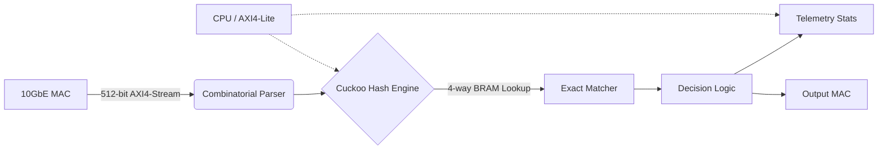

# HA-TFF: Hardware-Accelerated Telemetry Firewall

## 1. What It Is
HA-TFF is a pure-RTL, line-rate packet classification and telemetry firewall targeting FPGA platforms. It is designed to filter 10GbE IPv4 TCP/UDP traffic using exact-match rules while tracking detailed hardware-level telemetry via an AXI4-Lite interface.

## 2. The Architecture


The system operates on a 512-bit wide AXI4-Stream bus, allowing the entire 42-byte Eth/IPv4/UDP header stack to be parsed combinatorially on the first clock cycle. The 104-bit 5-tuple is extracted and fed into a cryptographic XOR-Fold hash engine, which indexes 4 parallel BRAM blocks to execute Cuckoo Hashing lookups in `O(1)` time.

## 3. Key Features
- **Zero-DSP Footprint:** Relies purely on LUTs and BRAMs to ensure cross-platform compatibility without DSP slice consumption.
- **16-Cycle Exact Match:** The datapath utilizes an exact 16-cycle pipeline depth (including delay lines) to perfectly align parsing, hashing, and decision assertion.
- **Hardware Telemetry:** Zero-latency statistics collection (stalls, drops, bytes) integrated into the datapath without violating timing constraints.

## 4. Performance Results
- **Timing Closure:** 156.25 MHz (6.4ns period) on Xilinx Artix-7 (`xc7a100tfgg484-1`).
- **Throughput:** Capable of sustaining line-rate 100GbE processing given the 6.72ns inter-packet arrival budget.

## 5. How to Reproduce
```bash
git clone https://github.com/Ganeshkumara26/ha-tff.git
cd ha-tff
make sim-icarus   # Run the Icarus Verilog testbench
make synth-vivado # Run Vivado synthesis for Artix-7
```
