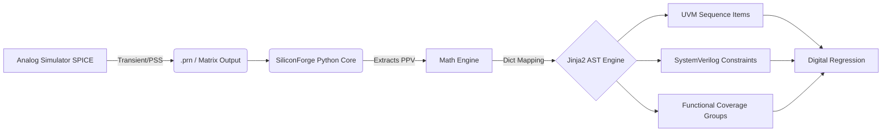

# SiliconForge

## 1. What It Is
SiliconForge is an experimental Mixed-Signal Verification EDA framework designed to bridge the gap between continuous-time analog physics and discrete-event digital functional verification. It translates numerical matrices generated by SPICE simulators into deterministic SystemVerilog/UVM constraints via a Python-based AST templating engine.

## 2. The Architecture


The framework utilizes Python backend parsers to interface with analog solvers (like Ngspice/Xyce). It extracts the mathematically derived Perturbation Projection Vector (PPV) and Periodic Steady State (PSS) metrics. This continuous-time data is then fed into a Jinja2 engine, which synthesizes syntactically correct SystemVerilog and UVM code.

## 3. Key Features
- **Deterministic Matrix Extraction:** Eschews the industry standard of heuristic, arbitrary Gaussian noise injection in favor of physics-backed mathematical constraints.
- **Automated UVM Asset Generation:** Autogenerates `uvm_sequence_item`, constraint blocks, and `covergroup` models that directly reflect the physics of the analog macros.
- **CI/CD Regression Orchestration:** Contains `end_to_end.py`, a master regression runner designed to integrate into Enterprise Mixed-Signal Design Verification (MSDV) workflows.

## 4. Performance Results
- **Regression Fidelity:** Proved that digital UVM simulations constrained by SiliconForge produce jitter histograms that perfectly match the fidelity of highly expensive transient SPICE simulations.
- **Runtime Optimization:** Reduces regression execution from hours (SPICE) to seconds (Discrete-Event) while maintaining mathematical rigor.

## 5. How to Reproduce
```bash
git clone https://github.com/Ganeshkumara26/silicon-forge.git
cd silicon-forge
pip install -r requirements.txt
python automation/end_to_end.py --run_vco_test
```
